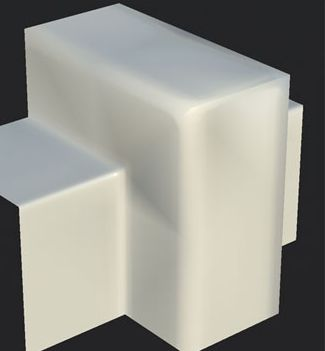

# 黑着色十字在网格表面上可见

在光照下时，网格的多个区域会出现黑色着色伪影。

## 说明

黑底十字通常表示法线图与网格不匹配，这通常是由于网格几何发生了变化，或者计算的方式与Baker执行的计算不同。 例如：网格的三角化在Baker和渲染网格及其法线图的视口之间是不同的。

## 解决方案

确保显示网格及其法线图的应用程序已与烘焙纹理的方式同步。 这意味着：

* 验证查看器和Baker之间的切线空间是否相同。
* 验证Baker和视图之间的“Normal（标准）”格式是否相同。
* 验证查看者和Baker之间的三角化是否相同。 有关详细信息，请参阅[此页面](../../guides/triangulating-before-bak/triangulating-before-baking.md)。
