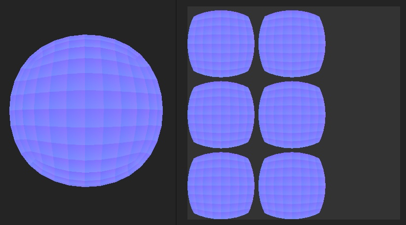

# 正常纹理看起来是多面的

>[!WARNING]
>
> **问题**
> 
> 经过烘焙后，“法线”纹理看起来呈多面性，或者网格的每个面都可见。
> 
> 

>[!NOTE]
>
> **说明**
> 
> 烘焙法线会产生这种结果的主要原因是低多边形网格法线的设置不正确。 每个面的每一边都是一个硬边，使得光线投影与高多边形网格匹配时忽略邻域信息，产生接缝或无意识信息。 虽然效果在网格上看起来不错，但这可能会导致稍后出现着色问题，应予以解决。

>[!NOTE]
>
> **解决方案**
> 
> 主要解决的方法是对顶点法向或低多边形网格进行重工，该过程的精确命名取决于3D建模软件：
> 
> * 在胡迪尼的Maya使用&#x200B;**平均法线**。
> * 在3DS Max中使用&#x200B;**一个平滑组**。
> * 在混合器中使用&#x200B;**平滑阴影**。
> * 从zBrush导出的网格将始终刻面，并且应在其他软件中进行清理。
> 
> 请注意，这可能不够：请确保在导出网格时这些设置还保存/生成顶点法向或着色信息。
