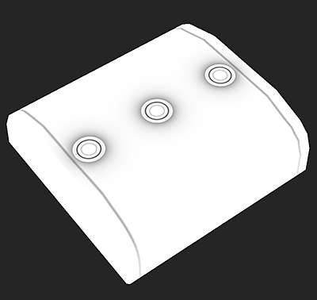
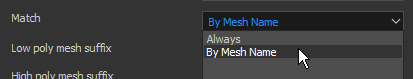

# 按名称匹配

“按名称匹配”是一种过滤方法的名称，在Substance Bakers中，可使用该方法根据名称隔离低多边形网格和高多边形网格。

此功能对于避免在烘焙过程中几何形状相互溢出以实现干净的纹理非常有用。 它避免了必须移开网格（通常称为“爆炸”）才能获得相同的结果。

## 何时按名称使用匹配

### 网格渗出的法线图烘焙

在本例中，角色头部顶部的头盔会出血到角色面部上。

通过启用“按名称匹配”，我们可以忽略头盔并正确烘焙面部。 *此结果基于主“匹配”设置。*

| *网格* | *关闭按名称匹配* | *按名称匹配* |
| --- | --- | --- |
| {width="250px"} | {width="250px"} | {width="250px"} |

### 浮动几何的“忽略背面”

在此示例中，框顶部的“按钮”是浮动几何，它们未连接到高多边形网格。 因此，默认情况下，它们将在它们下面的框上投影，这将显示几何边框。

通过为&#x200B;**忽略背面**&#x200B;设置启用“按名称匹配”，我们可以烘焙环境遮蔽，同时忽略按钮下方的区域，使其看起来像一个单数框。*此结果基于使用“忽略背面”设置。*

| *网格* | *关闭按名称匹配* | *按名称匹配* |
| --- | --- | --- |
| {width="250px"} | {width="250px"} | {width="250px"} |

## 按名称匹配的工作方式

“按名称匹配”系统的工作方式是：读取低多边形网格和高多边形网格中的几何名称，然后使用关键字（后缀）来识别/匹配名称。 默认情况下，Baker使用特定的后缀，但可以进行更改（请参阅下文）。

支持的当前后缀包括：

| *后缀类型* | *默认值* | *用法* |
| --- | --- | --- |
| 高多边形 | *\_high* | 用于隔离高模网格名称以匹配低位多边形。 |
| 低多边形 | *\_low* | 用于隔离低模网格名称以匹配高多边形名称。 |
| 忽略背面 | *\_ignorebf* | 用于忽略使用次生射线（如Ambient occlusion）的Baker的背面。*此后缀应仅存在于高多边形网格上，例如：**网格\_high\_ignorebf*** |

为使此功能正常工作需要考虑的一些规则：

* 必须在[公共参数](../../bakers-settings/common-parameters/common-parameters.md)中启用“按名称匹配”，因为默认情况下为&#x200B;**关闭**。
* 某些Baker（如[Ambient occlusion](../../bakers-settings/ambient-occlusion-from/ambient-occlusion-from-mesh.md)）中可能启用了按名称匹配的辅助设置，因为它们会生成次生射线。
* 匹配区分大小写，这意味着名为“**Vela**”的网格将与名为“**vela**”的路径不匹配。
* 可根据几何名称中后缀出现的位置来匹配多个网格。

下面是匹配可能的工作方式示例（使用默认后缀）：

| 低多边形名称 | 将与高多边形匹配 | 无法与高多边形匹配 |
| --- | --- | --- |
| <ul data-preserve-html="true"><li data-preserve-html="true">body_low</li></ul> | <ul data-preserve-html="true"><li data-preserve-html="true">body_high</li><li data-preserve-html="true">body_high_top</li><li data-preserve-html="true">body_high_1</li><li data-preserve-html="true">body_high_2</li></ul> | <ul data-preserve-html="true"><li data-preserve-html="true">身体 — 高度</li><li data-preserve-html="true">body_top_high</li></ul> |
| <ul data-preserve-html="true"><li data-preserve-html="true">Head_low</li></ul> | <ul data-preserve-html="true"><li data-preserve-html="true">Head_high</li></ul> | <ul data-preserve-html="true"><li data-preserve-html="true">head_high</li></ul> |
| <ul data-preserve-html="true"><li data-preserve-html="true">Leg_low_top</li></ul> | <ul data-preserve-html="true"><li data-preserve-html="true">Leg_high</li><li data-preserve-html="true">Leg_high_top</li><li data-preserve-html="true">Leg_high_high_top</li></ul> | <ul data-preserve-html="true"><li data-preserve-html="true">Leg_top_high</li></ul> |

## 如何设置烘焙师

### 启用按名称匹配

可以在面包机设置的[公共参数](../../bakers-settings/common-parameters/common-parameters.md)中启用按名称匹配：

| *软件* | *设置配置* |
| --- | --- |
| **Substance Painter** | <ol class="steps" data-preserve-html="true"> <li class="step" data-preserve-html="true">     打开烘焙窗口（通过“纹理设置”）。    </li> <li class="step" data-preserve-html="true">     显示公共参数。    </li> <li class="step" data-preserve-html="true">     将设置<strong>Match</strong>从“Always”更改为“By Mesh Name”。      </li> </ol> |
| **Substance Designer** | <ol class="steps" data-preserve-html="true"> <li class="step" data-preserve-html="true">     打开烘焙窗口（通过右键单击浏览器窗口中的链接网格）。    </li> <li class="step" data-preserve-html="true">     将设置<strong>匹配</strong>从“始终”更改为“按网格名称”。       </li> </ol> |

### 更改后缀名称

默认后缀为\_low和\_high，可通过以下方式进行更改：

* **Substance Painter**：在[烘焙窗口](../../getting-started/software-interface/3d-painter/substance-3d-painter.md)中，在公共参数内。
* **Substance Designer**：在[项目设置](https://experienceleague.adobe.com/zh-hans/docs/substance-3d-designer/using/workspace/preferences/project-settings)中的烘焙设置下。

## zBrush中的高多边形网格

从zBrush导出的高多边形网格可用于通过“按名称匹配”功能烘焙，但遵循一些设置：

| *文件格式* | *描述* |
| --- | --- |
| **FBX** | 无特定参数可启用/禁用，网格文件可按原样使用。 |
| **对象** | 默认情况下，zBrush导出的OBJ文件不能使用&#x200B;**按名称匹配**。 相反，可以指示Substance Painter改用网格文件名按名称匹配网格。要执行此操作，请确保：<ol data-preserve-html="true"><li data-preserve-html="true"><strong>禁用</strong>每个</strong>子工具的组(Grp)参数。<strong></li><li data-preserve-html="true">适当地<strong>命名</strong> OBJ文件（例如： <strong>body_high.obj</strong>）。</li></ol>  |
