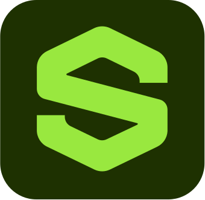
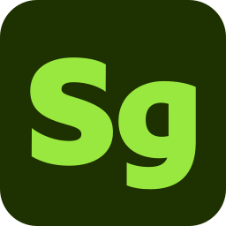
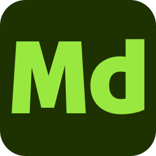

# 艺术家的Substance 3D图标

<table>
  <tr style="border: 0;">
    <td style="border: 0;" valign="top"></td>
    <td style="border: 0;" valign="top"></td>
    <td style="border: 0;" valign="top"></td>
    <td style="border: 0;" valign="top"></td>
    <td style="border: 0;" valign="top"></td>
    <td style="border: 0;" valign="top"></td>
    <td style="border: 0;" valign="top"></td>
  </tr>
</table>

艺术家如果希望在已发布的图稿中包含Substance 3D应用程序的图标，可以在下面下载这些图标。 图像使用SVG格式，因此它们可以用于任何比例。

[下载一个包含彩色、黑白版本的Substance 3D应用程序图标的zip文件夹。](../../assets/substance3d-icons.zip)

## Creative Cloud库

Creative Cloud用户可以通过此共享库访问Creative Cloud应用程序中的以下图标：

[Substance 3D图标](https://www.adobe.com/files/libraries/urn:aaid:sc:EU:0e944904-0efe-427f-8547-92744a19eaf)

## 示例

