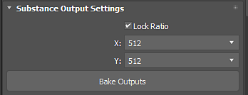
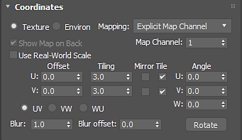

# 3ds Max中的Substance概述

## 增效工具概述：

## 打开Substance

1. 打开Slate编辑器，搜索Substance并将Substance2节点拖动到视图中。
1. 双击Substance节点以激活属性，然后在“Substance包浏览器”下加载一个Substance。

   >[!NOTE]
   >
   > 您还可以将.sbsar文件拖放到板式编辑器中，以自动创建节点并导入sbar。
1. 如果Substance包含多个图形，则可以在“选定图形”下拉菜单中选择要输出为素材的图形。

   

   
1. 选择Substance节点后，转到“Substance”菜单并选择支持的渲染器。 材料即被创建并准备应用于对象。 Substance纹理被钩接到渲染材料中。

   | 支持的渲染器 |
   | --- |
   | Arnold |
   | 弗赖 |
   | 科罗纳 |
   | 辛烷值 |

   

## 更改分辨率：

1. 在“Substance输出设置”中为计算的Substance纹理设置所需分辨率。
1. 要获得高达8K的分辨率，请确保您使用的是GPU引擎，该引擎在[Substance设置](../../../3d-applications/3ds-max/settings-1/substance-settings.md)中设置。

   

## 更改参数：

1. 双击Substance节点，在参数窗口中加载Substance参数。
1. 更改参数以自动更新Substance纹理。

   {width="500px"}

## 设置输出预览：

您可以为Substance节点的缩览图设置特定声道。

1. 在“输出预览”下拉列表中，选择要用于节点缩览图的通道。

   

## 拼贴Substance：

您可以使用“坐标”属性来平铺Substance纹理并设置“映射通道”。

