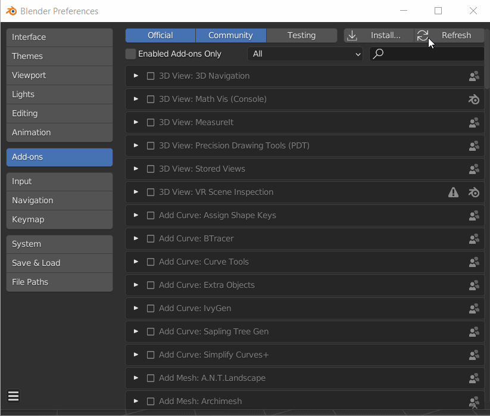

# 下载和安装插件

## 下载

可从[Blender中的Substance 3D](https://substance3d.adobe.com/plugins/substance-in-blender/)下载该插件。 单击<b>Adobe适用于Blender的Substance 3D加载项</b>，以使用Adobe帐户登录并访问下载页面。 导航到页面底部，以下载Substance 3D插件和Substance 3D集成工具的.zip文件。

有两个单独的.zip文件可供下载和安装：

* 适用于Blender的Substance 3D插件（适用于所有平台的单个下载项）
* Substance 3D Integration Tools（下载Windows、Mac或Linux版本）

>[!WARNING]
>
> <b>对于Mac用户：</b> *如果用户使用Safari下载加载项，则应禁用“下载后打开安全文件”。*
> 
> 默认情况下，Safari Web浏览器会解压缩下载的.zip文件，在安装过程中，这些文件需要保持压缩状态。 要禁止解压缩文件，请更新Safari偏好设置，使其在下载后不打开“安全”文件。
> 
> 1. 打开Safari
> 1. 单击“首选项”
> 1. 在常规选项卡下，取消选中下载后打开“安全”文件选项

## 安装步骤

### 首次安装

1. 从Adobe预发布页面下载加载项.zip文件。
1. 打开混合器(v. 3.0或更高版本)。
1. 从顶部导航栏中，选择编辑，然后选择首选项。 然后选择加载项选项卡。
1. 单击&#x200B;**安装**&#x200B;按钮。
1. 在文件资源管理器中，找到将.zip文件下载到的目标文件夹
1. 选择Substance3DInBlender.zip文件并单击&#x200B;**安装加载项**&#x200B;按钮。
1. 在加载项部分中，单击复选框以启用加载项，然后单击下拉箭头以展开该部分。
1. 系统将提示您安装集成工具。 单击&#x200B;**从磁盘安装**&#x200B;以选择Substance3DIntegrationTools.zip，然后单击&#x200B;**安装工具**&#x200B;按钮。\
   如果以前未下载这些工具，请单击&#x200B;**下载**&#x200B;以打开浏览器中的Adobe预发布页面并下载这些工具，然后使用&#x200B;**从磁盘安装**&#x200B;进行安装。
1. 加载项现在可以使用！

### 更新加载项和工具

1. 从“Adobe预发布”页面下载最新版本。
1. 使用&#x200B;**“卸载工具”**&#x200B;按钮删除“Substance3D集成”工具。
1. 使用&#x200B;**删除**&#x200B;按钮卸载该加载项
1. 关闭并重新启动混合器
1. 从顶部导航栏中，选择编辑，然后选择首选项。 然后选择加载项选项卡。
1. 单击&#x200B;**安装**&#x200B;按钮。
1. 在文件资源管理器中，找到将.zip文件下载到的目标文件夹
1. 选择Substance3DInBlender.zip文件并单击&#x200B;**安装**&#x200B;加载项按钮。
1. 在加载项部分中，单击复选框以启用加载项，然后单击下拉箭头以展开该部分。
1. 系统将提示您安装集成工具。 单击&#x200B;**从磁盘安装**&#x200B;以选择Substance3DIntegrationTools.zip，然后单击&#x200B;**安装工具**&#x200B;按钮。\
   如果以前未下载这些工具，请单击&#x200B;**下载**&#x200B;以打开浏览器中的Adobe预发布页面并下载这些工具，然后使用&#x200B;**从磁盘安装**&#x200B;进行安装。
1. 加载项现在可以使用！

### 更新单个组件

仅更新加载项时：

1. 从加载项首选项中，使用&#x200B;**删除**&#x200B;按钮卸载该加载项。
1. 重新启动混合器
1. 再次导航到加载项偏好设置，并使用&#x200B;**安装**&#x200B;按钮加载加载加载项的新版本。 以前加载的集成工具将保留。

仅更新集成工具时：

1. 从加载项首选项中，使用&#x200B;**更新工具**&#x200B;按钮加载集成工具的较新版本。 以前使用的插件将保留。
1. 重新启动Blender以使更改生效。

或者

1. 从加载项首选项中，使用&#x200B;**卸载工具**&#x200B;按钮删除集成工具。
1. 重新启动混合器
1. 使用&#x200B;**从磁盘安装**&#x200B;按钮查找并加载较新版本的集成工具。 以前使用的插件将保留。
