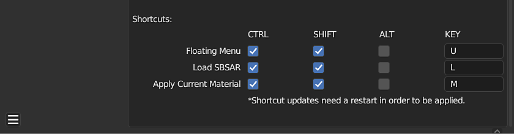

# Blender中的Substance概述

## 增效工具概述

利用Substance 3D插件，您可以将Substance素材导入Blender。 使用Substance 3D面板，您可以从一个位置管理和自定义项目中的Substance素材。 该插件从.sbsar文件生成纹理图，并使用它们创建混合器材质。 调整Substance参数时，这些纹理会自动更新。

## 导入Substance材料

1. 单击Substance 3D面板中的&#x200B;**加载**&#x200B;按钮。
1. 在打开的窗口中，导航到存储.sbsar文件的位置，然后选择一个或多个。 然后单击&#x200B;**载入Substance材质**&#x200B;按钮。
1. 单击“材料”面板中的球体图标以打开下拉菜单并选择您的Substance材料。 这会将材料指定给当前槽。 或者，使用“Substance 3D”面板中的“应用”按钮将素材指定到新的素材槽中，该素材槽不会覆盖当前指定。

>[!NOTE]
>
> 如果对象没有素材，则&#x200B;**应用**&#x200B;按钮将自动附加Substance素材。

## Substance 3D面板

Substance 3D面板用于管理项目中的Substance素材并调整其各个参数。 图形参数部分包含纹理分辨率、拼贴、随机化和预设的控件。 输出部分具有针对所生成纹理的图像格式的控件。 “Substance参数”部分是可以调整Substance参数的位置。

有关详细信息，请参阅[Substance 3D面板](../../../3d-applications/blender/the-3d-panel/the-substance-3d-panel.md)页面。

## 首选项

可以在加载项首选项中调整默认行为和其他设置。 可以启用“自动附加材料”以自动将Substance材料附加到对象并覆盖当前材料指定。 如果选中具有所选材质的对象，“自动突出显示所选对象的材质”将更改Substance 3D面板中突出显示的材质。 启用“循环自动更新纹理”将允许在使用“循环”渲染视图时，在3D视口中更新纹理。

可使用“输出”部分中的“Height切换”来启用位移。 在这里，您还可以调整每个输出的文件格式和位深度。

有关详细信息，请参阅[首选项](../../../3d-applications/blender/preferences/preferences.md)页面。

<table>
<tr style="border: 0;">
<td style="border: 0;" valign="top">

</td>
<td style="border: 0;" valign="top">

</td>
<td style="border: 0;" valign="top">

</td>
</tr>
</table>

## 查找更多Substance材质

数千种专业创作的材料和其他资源可在[Substance 3D Assets页面](https://helpx.adobe.com/cn/substance-3d/unlisted/assets.html)上下载。 在[Substance 3D社区资源页面](https://helpx.adobe.com/cn/substance-3d/unlisted/community-assets.html)上可以找到更多已由社区免费共享的资源

## 社区

如需一般帮助、反馈或报告缺陷，请加入[SubstanceDiscord服务器](https://discord.com/invite/substance3d)或[Adobe群](https://community.adobe.com/t5/substance-3d-plugins/ct-p/ct-substance-3d-plugins?page=1&sort=latest_replies&lang=all&tabid=all&topics=label-blender)上的#substance-blender-beta渠道。
