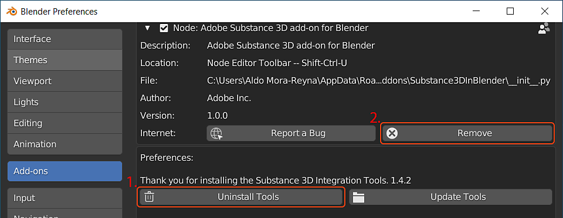

# 卸载加载项

要卸载该插件，请导航到“编辑”>“首选项”>“插件”，然后展开该插件的部分。

1. 首先使用&#x200B;**卸载工具**&#x200B;按钮删除集成工具。
1. 然后使用&#x200B;**删除**&#x200B;按钮删除加载项文件

>[!NOTE]
>
> 如果需要手动删除Substance集成工具，请从以下目录中删除Substance3DIntegrationTools文件夹
> 
> * **Windows**： C:\Users\（用户名）\AppData\Roaming\Adobe
> * **Mac**： /Users/(username)/Library/Application Support/Adobe/Substance3DIntegrationTools
> * **Linux**： /home/(username)/资源Adobe/Substance3DIntegrationTools

