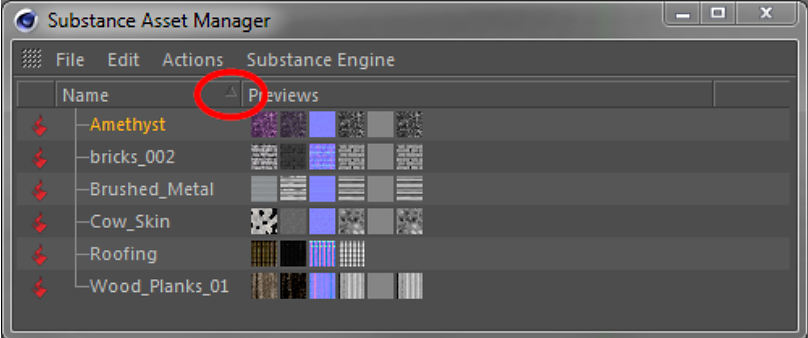

# Substance资产管理器

“Substance资产管理器”窗口将列出场景中加载的所有Substance。 您可以在此处添加、删除和重新组织Substance。

选择（左击）Substance资源管理器中的Substance可在Cinema 4D的属性管理器中打开Substance。 您可以在此处更改参数和关键帧Substance输入，就像Cinema 4D中的任何其他参数一样。

>[!NOTE]
>
> 属性管理器具有特殊的Substance资源模式，当您在Cinema 4D布局中拥有专门的Substance属性管理器时，这种模式会派上用场。

{width="500px"}

## “文件”菜单

## 加载资源……

将新Substance加载到场景中（与“插件”菜单中的相同）。

关闭

关闭Substance资源管理器。 加载的Substance当然会保留在场景中。

## “编辑”菜单

## 选择所有Substance

选择Asset Manager中列出的所有Substance。 当鼠标悬停在Asset Manager上时，按Ctrl+a也可以实现同样的效果。

## 取消选择所有Substance

取消选择Asset Manager中列出的所有Substance。 当鼠标悬停在Asset Manager上时，按Shift+Ctrl+a也可以实现同样的效果。

## 从所选材料中选择

选择当前&#x200B;*选定的* Substance引用的所有材料。

## 从标记的材料中选择

选择当前&#x200B;*已标记* Substance引用的所有材料。 在Cinema 4D中，如果选择了使用此材料的对象或标签，则标记该材料。

## 选择材料

选择引用当前所选Substance的所有材质。

## 动作菜单

## 创建材料

从当前选定的Substance创建新的Cinema 4D材质。 素材声道将通过Substance着色器参照Substance的相应输出声道自动初始化。

## 复制Substance

复制当前选定的Substance。 这可用于对多种材料使用具有不同参数集的同一Substance。

## 重新导入Substance

此函数可用于返回Substance的默认值或集成外部更改（例如，来自Substance Designer）。\
注意：Substance输入上的&#x200B;**所有**&#x200B;参数更改都将丢失！

## 删除Substance

从场景中删除当前选定的Substance。 这可以通过在鼠标悬停在Asset Manager上时按Delete键来实现。

## 删除未使用的Substance

删除当前未由任何材料引用的所有Substance。

## Substance 引擎菜单

此菜单的内容取决于运行Cinema 4D的操作系统。 只有在重新启动Cinema 4D后，对Substance 引擎的更改才会生效。

## Context menu

通过右键单击所选Substance，将显示上下文菜单。 它们的功能与上述菜单中同名的函数相同：

* 删除
* 创建材料
* 复制Substance
* 重新导入Substance
* 选择所有Substance
* 取消选择所有Substance
* 选择材料

## 拖放

您可以通过拖放与Substance资源管理器交互。 有多个可用选项：

* 只需将Substance拖放到Substance资产管理器中，即可从资源管理器或Finder中拖放内容以将其加载到场景中。
* 可以将Substance拖入Substance着色器的链接字段，以便连接着色器和Substance资源。
* 如果在未排序模式下（请参见下文），则可以通过将Substance拖动到新位置来重新排列Asset Manager中的页面。

## 在SubstanceAsset Manager中排序

## 未排序模式

## 默认情况下，SubstanceAsset Manager处于&#x200B;**未排序模式**。 名称列的标题单元格不会在右侧显示箭头。 您可以使用拖放操作根据自己的喜好重新排列各种物质。

{width="500px"}

{width="500px"}

## 在Substance资产管理器中预览

## Substance资产管理器会显示小图标，其中包含每个Substance可用声道的预览。

## 预览仅按照Substance中输出声道的顺序显示。 显示预览的列没有含义。
