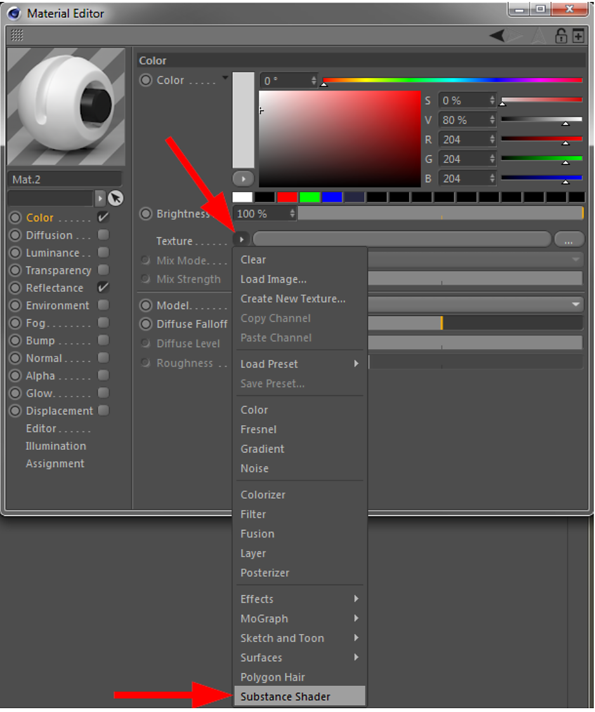
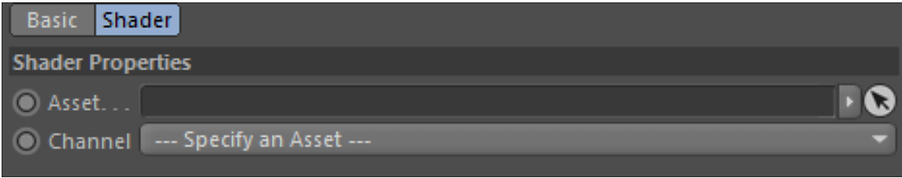

# Substance着色器

着色器是Substance资源与Cinema 4D材料之间的链接。

可以在常规Substance编辑器选择菜单中找到Cinema 4D着色器，如下面的屏幕截图所示：

{width="500px"}

手动添加着色器后，它将没有链接的Substance资源。 它看起来如下所示，渲染后，材料的外观将像右侧的图像：

{width="500px"}

要访问着色器的参数，可以单击左上角的小箭头或着色器的预览图像。

{width="500px"}

## 参数

着色器有两个参数：

* **资源：**&#x200B;可在此处从Substance资源管理器中删除Substance资源以将其链接到着色器。 换句话说，它将Substance资源链接到Cinema 4D材料渠道。
* **通道：**&#x200B;选择链接Substance的输出通道。
