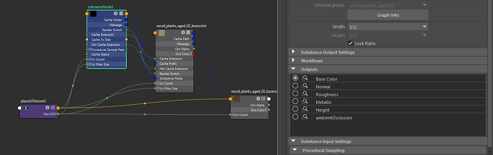

# 使用输出

可在“输出”部分中手动启用/禁用输出。

{width="800px"}

闭合圆表示已创建输出。 在上图中，可以看到已经创建了基色。 由于启用了缓存输出到磁盘，因此创建了一个Substance输出和一个Maya文件节点。 文件节点会读取磁盘上缓存的纹理，并且每当Substance 引擎处理纹理时，都会自动更新文件节点。 再次单击闭合的圆可禁用输出并删除节点。

单击眼镜图标以选择Substance输出或文件节点。 如果已创建文件节点，则单击眼镜图标时将选中该文件节点。 如果文件节点不存在，则将选择Substance输出。 这使您可以快速导航到输出或文件节点。 *\*提示：按F键可在节点编辑器中设置所选节点的框架。 当您有多个输出并需要查找特定的文件节点时，这会非常方便。*
