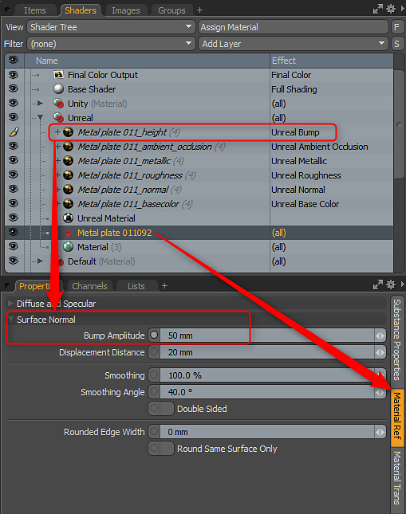

# 凹凸和位移

使用凹凸和位移

Substance可以具有可选的Height输出。 您可以将其用作位移或凹凸。 启用“Height”后，它将设置为凹凸纹理效果。 对于Unity来说，它将会变成Unity Bump，而Unreal Bump将变成Unreal Bump。 然后，您可以选择Substance项目材质并相应地设置凹凸振幅。 如果要使用Height作为位移，您可以将素材图层效果更改为表面着色>位移。 然后在“材料参考”中，设置适当的“位移距离”。

在本例中，我使用了不真实的材质，但将不真实的凹凸图层效果更改为位移。 然后在Substance项目材质上，设置位移距离并相应地渲染细分级别。

