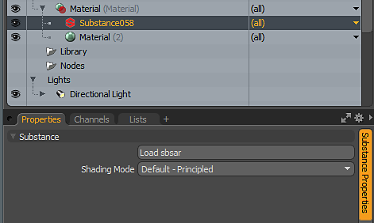

# “MODO概述”中的Substance

## 概述：

## 打开Substance

1. 创建材质或选择材质组。
1. 在“纹理”>“Substance”下，选择创建Substance，或使用“Substance工具包”选项下的“创建”按钮。 这将在着色器树中创建Substance素材。
1. 单击载入sbsar以载入sbsar文件。

   

## 创建输出

使用&#x200B;**默认 — 原则着色模式**，您可以使用金属/粗糙度工作流程创建输出。

1. 在“Substance属性”的“输出”部分中，单击着色所需的输出。 将生成Substance纹理，并使用正确的材质图层效果将其添加到着色器树中。 对于原则着色模式，您需要以下各项：

   | Substance输出 | 色彩空间 | 材质图层效果（原则性着色模式） |
   | --- | --- | --- |
   | 底色 | sRGB | 散射颜色 |
   | 法线 | 线性 | 法线 |
   | 粗糙度 | 线性 | 粗糙度 |
   | 金属 | 线性 | 金属 |

   

## 更改分辨率/参数

可以更改Substance参数以更新或更改生成的纹理。 更改参数将导致Substance 引擎重新计算馈入MODO材料的纹理。

1. 转到Substance素材的“Substance属性”，然后在“微调”部分中更改任一参数。

   
1. 您可以使用输出大小下拉菜单更改生成的纹理的分辨率。 Substance可以设置为生成最多8K的图像。 8K输出需要[SubstanceGPU引擎](../../../3d-applications/modo/modo-switch-engine/modo-switch-engine.md)。
