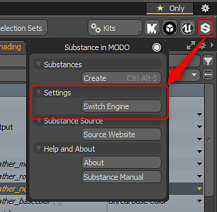

# Modo切换引擎

## 切换Substance 引擎

该Substance 引擎有两个版本，即CPU和GPU。 GPU引擎用于创建高于2K的纹理。 CPU引擎仅能够生成高达2K的纹理。 如需更高分辨率的纹理，需要切换到GPU引擎。

转到“Substance工具包”菜单中的“Substance设置”选项，然后选择“切换Substance 引擎”。 您需要重新启动MODO才能启用GPU引擎。 此设置用作全局首选项。 然后，每次运行MODO时都会启用GPU引擎，直到手动切换它为止。

>[!NOTE]
>
> **使用SubstanceGPU引擎需要具有1GB或更大专用视频内存的GPU。 不支持集成的GPU。**\
> Nvidia：GeForce 650M 1 GB或更高\
> AMD：6870M或更高

