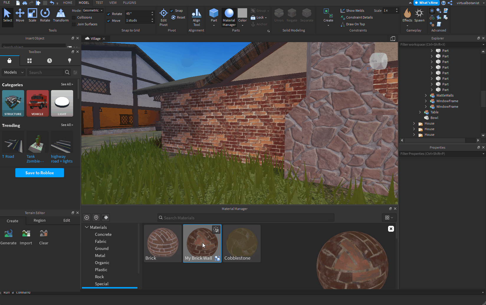

# Roblox

[Roblox](https://www.roblox.com/)是一个用于沉浸式3D多人体验的平台。 Roblox设计工具Roblox Studio支持PBR金属粗糙度工作流程。

<table>
<tr style="border: 0;">
<td width="58.30%" style="border: 0;" valign="top">

## Substance 3D Designer模板

要为Roblox创建纹理，您可以将下面的Substance 3D文件用作[Substance 3D Designer](https://experienceleague.adobe.com/en/docs/substance-3d-designer/home)中的[Substance合成图形](https://experienceleague.adobe.com/zh-hans/docs/substance-3d-designer/using/substance-graphs/substance-compositing-graphs)模板。

[{width="64px"}](https://helpx.adobe.com/content/dam/roblox.sbs)

此图形模板允许预配置最终纹理文件名和类型。 可安装并重新使用此模板来创建始终遵循Roblox材料准则的新材料。

</td>
<td width="41.60%" style="border: 0;" valign="top">

{width="200px"}

</td>
</tr>
</table>

## Designer到Roblox的工作流程

<table>
<tr style="border: 0;">
<td style="border: 0;" valign="top">

### 安装模板

首先，*安装* Roblox模板。

* 下载上面链接的模板文件。
* 转到Designer的用户文档目录：
* （桌面Creative Cloud） `/Documents/Adobe/Adobe Substance 3D Designer`\
  （蒸汽） `/Documents/Allegorithmic/Substance Designer/`
* 创建“模板”文件夹。
* 将文件放在该文件夹中。

</td>
<td style="border: 0;" valign="top">

{width="512px"}

</td>
</tr>
</table>

<table>
<tr style="border: 0;">
<td style="border: 0;" valign="top">

### 检测模板

然后，让Designer *监视*&#x200B;模板文件夹以查找图形模板。

* 在Designer中，转到&#x200B;**编辑>首选项……**
* 在[首选项](https://experienceleague.adobe.com/zh-hans/docs/substance-3d-designer/using/workspace/preferences/preferences-window)窗口中，转到&#x200B;**项目>用户项目>常规**
* 在&#x200B;**模板目录**&#x200B;列表中，单击&#x200B;**+**&#x200B;按钮
* 转到`templates`目录并单击&#x200B;**选择文件夹**
* 单击&#x200B;**确定**&#x200B;按钮
* 转到&#x200B;**文件>新建>图形...**
* 检查`Roblox`模板是否列在[新建图形](https://helpx.adobe.com/cn/substance-3d/unlisted/documentation/sddoc/create-a-graph-102400068.html)窗口的模板列表底部

</td>
<td style="border: 0;" valign="top">

{width="512px"}

</td>
</tr>
</table>

<table>
<tr style="border: 0;">
<td style="border: 0;" valign="top">

### 导出纹理

使用Roblox图形创建模板，并在材料处理完成后将位图导出到该图形之外。

* 在[新建图形](https://helpx.adobe.com/cn/substance-3d/unlisted/documentation/sddoc/create-a-graph-102400068.html)窗口中，选择`Roblox`模板
* 为图形设置任何标识符和其他参数，然后单击&#x200B;**确定**
* 在[图形视图](https://experienceleague.adobe.com/zh-hans/docs/substance-3d-designer/using/workspace/graph-view/the-graph-view)中处理您的材料 — 请参阅[此处](https://experienceleague.adobe.com/zh-hans/docs/substance-3d-designer/using/getting-started/workflow-overview)了解如何开始使用工作流
* 完成后，转到&#x200B;*工具栏*&#x200B;中的&#x200B;**图形视图>导出位图……**
* 在[导出位图](https://experienceleague.adobe.com/zh-hans/docs/substance-3d-designer/using/substance-graphs/exporting-bitmaps)窗口中，设置有效的&#x200B;**目标**&#x200B;路径，确保&#x200B;*全部*&#x200B;输出已&#x200B;*选中*，然后单击&#x200B;**导出**
* 检查纹理是否正确导出到&#x200B;**目标**&#x200B;路径

</td>
<td style="border: 0;" valign="top">

{width="512px"}

</td>
</tr>
</table>

<table>
<tr style="border: 0;">
<td style="border: 0;" valign="top">

### 在Roblox中创建材料

在Roblox中，创建一个材料变体并分配从Designer导出的纹理。

* 选择&#x200B;**模型**&#x200B;选项卡，然后单击&#x200B;**材料管理器**
* 选择&#x200B;*材质模板*，然后单击&#x200B;**创建变体**&#x200B;按钮
* 在&#x200B;**创建变体**&#x200B;窗口中，设置素材的名称
* 对于&#x200B;*每个素材通道*，单击&#x200B;**导入**&#x200B;按钮，然后选择从Designer导出的相应纹理
* 单击&#x200B;**保存**

</td>
<td style="border: 0;" valign="top">

{width="512px"}

</td>
</tr>
</table>

<table>
<tr style="border: 0;">
<td style="border: 0;" valign="top">

### 应用材质

在Roblox场景中使用新的素材变体

* *选择* Roblox场景中的任何部分或网格
* 在&#x200B;**材质管理器**&#x200B;中，选择您的&#x200B;*材质变体*，然后单击&#x200B;**应用于所选部件**&#x200B;按钮

>[!NOTE]
>
> 如果纹理的颜色在Roblox中看起来不同，请检查应用材质变体的对象属性中&#x200B;**外观**&#x200B;类别下的&#x200B;**颜色**&#x200B;属性，并确保将其设置为&#x200B;*纯白* — 即RGB(255、255、255)，在Roblox中将其标记为&#x200B;*机构白色*。

</td>
<td style="border: 0;" valign="top">

{width="512px"}

</td>
</tr>
</table>

<table>
<tr style="border: 0;">
<td style="border: 0;" valign="top">

### 调整拼贴

可以随时调整该材料在表面（即拼贴）上的重复量。

* 在&#x200B;**材质管理器**&#x200B;中，选择您的&#x200B;*材质变体*，然后单击&#x200B;**编辑**&#x200B;按钮
* 在&#x200B;**编辑变体**&#x200B;窗口中，调整&#x200B;**其他**&#x200B;下&#x200B;**每个图块的Studs**&#x200B;属性的值 — *更低的*&#x200B;值会导致&#x200B;*更多*&#x200B;重复

</td>
<td style="border: 0;" valign="top">

{width="512px"}

</td>
</tr>
</table>
