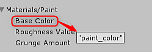

# API概述

## Substance.游戏

```
Using Substance.Game
```


Substance.Game是包含用于脚本的类的程序集。 这些类别如下：

**Substance.游戏。**&#x200B;**Substance**：引用sbsar

**Substance.Game.SubstanceGraph**： sbsar.*（在Unity 2017中曾是ProcedualMaterial）*&#x200B;中的单个图形

## 脚本编写过程

1. 创建SubstanceGraph实例
1. 在图形实例上设置参数。
1. 将Substance排队以渲染： QueueForRender()会将Substance图形添加到队列。 此列表将在下次调用RenderAsync或RenderSync时进行处理。

### 图形实例参数

```
// panel color 

mySubstance.SetInputColor("paint_color", color); 

 

// panel size 

mySubstance.SetInputVector2("square_open", panelSize); 

 

// wear level 

mySubstance.SetInputFloat("wear_level", wearLevel);
```


引号中的值是Substance Designer中设置的参数“标识符”。

在Unity Inspector中，可以将鼠标悬停在参数上以显示工具提示，其中显示了Substance Designer中设置的标识符的名称。



### 将物质排队以进行渲染

```
// queue the substance to render 

mySubstance.QueueForRender(); 

 

//render all substances async 

Substance.Game.Substance.RenderAsync();
```


>[!NOTE]
>
> 目前，我们仅支持x86\_64体系结构。 需要在“生成设置”中设置x86\_64


