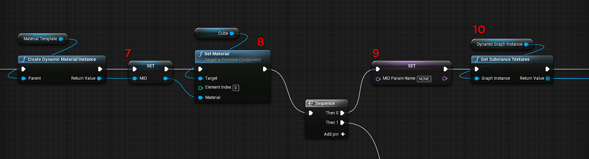

# Blueprint(UE4)：动态材质实例

可以创建Substance 图形实例以在运行时创建动态图形实例。

1. 创建类型为“Substance实例工厂”的变量，并将默认值设置为“导入Substance工厂”。
1. 添加一个Create Graph Instance节点，并将Substance实例工厂插入工厂输入。 设置实例名称。
1. 创建另一个Substance实例工厂类型的变量。 这将包含对动态Substance素材的引用。
1. 使用“创建图形实例”节点的返回值设置动态Substance材质的变量。
1. 创建“材料”类型的变量。 这将是材料模板。 在Content Browser中，复制该Substance生成的UE4素材。 将此重复的材质设置为材质模板变量的输入。
1. 添加一个“创建动态材料实例”，并将“材料模板”变量设置为父级。

   {width="800px"}
1. 创建“材料”类型的变量。 这将是“材料实例动态”(Material Instance Dynamic，MID)。 将动态材质实例的返回值设置为变量。

   {width="800px"}
1. 添加“设置材质节点”，并将MID变量的值设置为“材质输入”。 对于目标，请将其设置为要应用素材的对象。
1. 创建类型为Name的变量。 此变量将保留素材中设置的通道的名称。 将其初始化为“NONE”
1. 添加“获取Substance纹理”节点，并将“图形实例”设置为“动态图形实例”变量。
1. 添加For循环节点。 这里，您可以循环查看“Substance纹理”。 将“获取Substance纹理”的结果作为输入数组。

   {width="800px"}
1. 使用for循环中的数组元素作为输入添加SubstanceGet Channel节点。
1. 添加序列节点。 在这里，我们将首先运行Get Channel节点的结果。
1. 在序列后面添加ESubChannelType上的开关，然后添加0 ，并将Get Channel返回值作为选择。 这里我们检查频道名称。
1. 将MID名称变量设置为步骤5中复制的Substance素材中的声道名称。 *查看素材图像。*
1. 在“序列”节点Then 1中，将设置将通道名称分配给动态材料的过程。
1. 获取MID名称变量并添加值为“NONE”的相等字符串节点。此值将初始化变量。
1. 从“等于”节点添加带有“条件”的分支节点。
1. 添加Substance集纹理参数值。 目标为MID变量，参数名称为MID名称变量。 该值是ForEachLoop节点中的Array元素。

{width="800px"}
