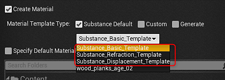

# 物料实例定义 — UE4

您可以将UE4材料实例与Substance结合使用。 这样无需上传新的材料来处理，从而在GPU渲染过程中节省一大步。 可以在运行时或在编辑器中创建MID。 在版本4.24.0.3中，我们添加了对模板实例化的完全支持，并引入了一个新的Substance 引擎材料工作流，其中包含模板支持的数字输出。 通过材料模板，可以确切定义如何在UE4中配置Substance材料着色器。

导入sbsar 文件时，可以选择要使用的模板。

我们随附了用于处理位移、折射和世界对齐材料的模板，这些模板内置了用于调整拼贴、纹理大小、位移和emissive参数的控件。 材料模板系统还允许您提供自己的自定义模板。

## 在编辑器中创建材质实例

1. 右键单击Substance创建的UE4材料，然后选择“创建材料实例”。 这将创建一个UE4实例材料。

   {width="560px"}
1. 右键单击Substance实例工厂，然后选择“创建图形实例”。 这将创建该图形的一个实例，并创建另一个UE4材料。 删除新创建的UE4材料，因为这将不会使用它。

   {width="300px"}
1. 双击在步骤1中创建的材质实例，并为所有映射启用“纹理”参数。
1. 将纹理设置为从步骤2创建的新INST纹理。 这会将素材实例设置为使用实例图形中的Substance输出映射。

   {width="800px"}

您现在有一个UE4材料实例，它使用一组特定的Substance纹理。 这是在UE4项目中处理多种物质的一种更优化的方式。 要了解如何使用Blueprint创建MID，请查看此页面。 [蓝图(UE4)：动态素材实例](https://helpx.adobe.com/cn/substance-3d/unlisted/documentation/integrations/blueprint-dynamic-material-instance-152535142.html)
