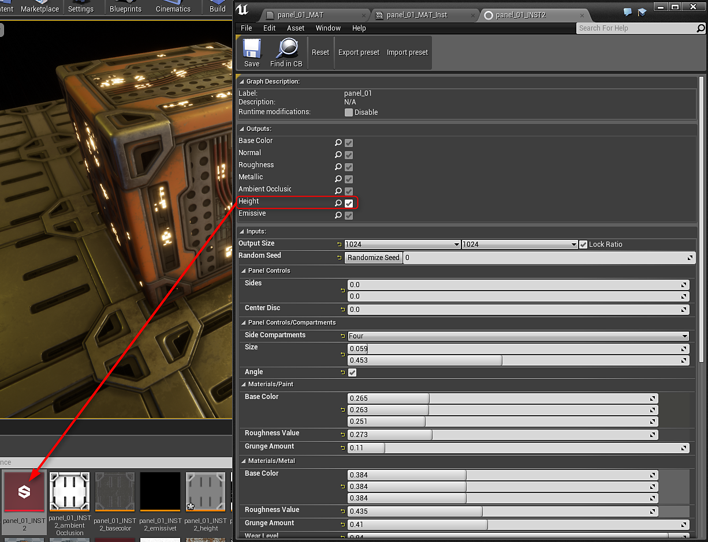
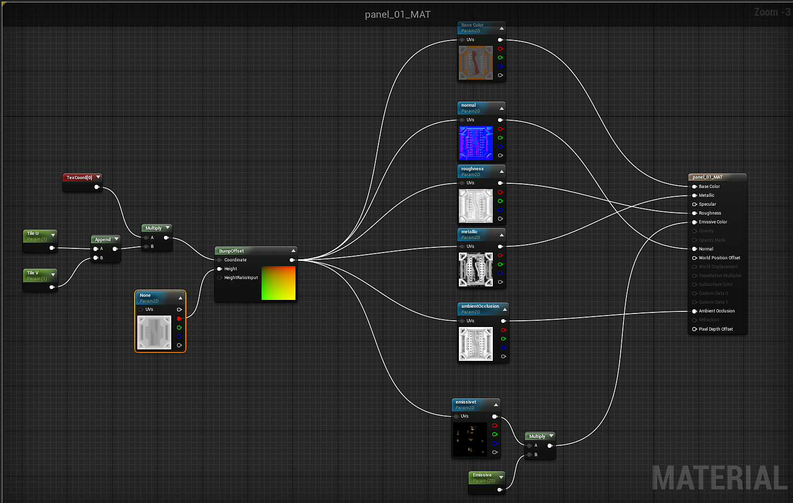

# 使用凹凸偏移（视差） - UE4

**凹凸偏移**&#x200B;映射通过以创造性的方式修改UV坐标来赋予表面一种深度的错觉，从而帮助进一步置换对象表面的纹理，给人一种表面具有比实际更多细节的错觉。 在此“方法”示例中，我们将不仅介绍如何找到“凹凸偏移”材料表达式，还将介绍如何在“材料”中利用“凹凸偏移”节点。

<https://docs.unrealengine.com/latest/INT/Engine/Rendering/Materials/HowTo/BumpOffset/>

要使用Height输出，需要双击Substance工厂实例中的输出以创建Height。 默认情况下不启用Height。 然后可以将此Height输出拖入素材。

{width="600px"}

创建凹凸偏移节点，然后将Height的红色通道插入Height。 然后可将“文本坐标”输入到凹凸偏移的“坐标”输入中。 最后，凹凸偏移的输出插入到所有Substance纹理的UV输入中。

{width="800px"}
