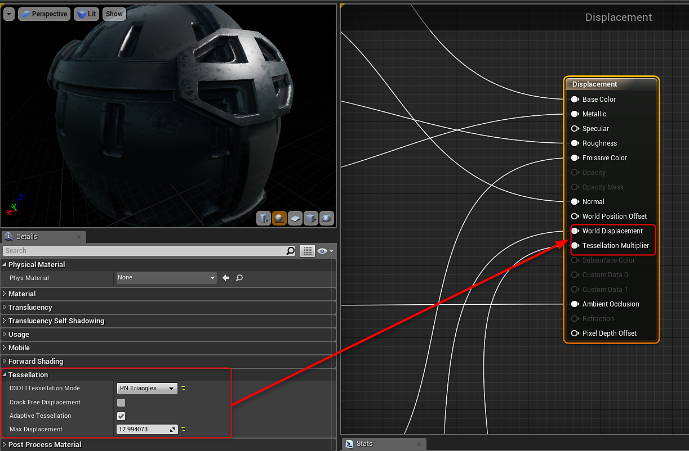

# 使用位移- UE4

要使用位移，您需要在材料上启用曲面细分。

{width="600px"}

要使用Height输出，需要双击Substance工厂实例中的输出以创建Height。 默认情况下不启用Height。 然后可以将此Height输出拖入素材。

{width="800px"}

将Height输出添加到材料后，您需要创建一些节点来驱动World位移和曲面细分修饰符。

1. 创建2个标量参数。 一个是距离，另一个是曲面细分的乘数。
1. 将“红色”通道从Height乘以“距离”参数
1. 添加一个VertexNormalWS节点，并在步骤2中使用乘法的输出乘以此节点。
1. 输入材料上VertexNormal与World位移的乘数。
1. 将曲面细分乘数参数输入到材料上的曲面细分乘数。

{width="800px"}

>[!NOTE]
>
> 为了简化图形，此图像中省略了其他纹理输出。 为了清晰起见，此处只显示了位移和乘法器节点。
