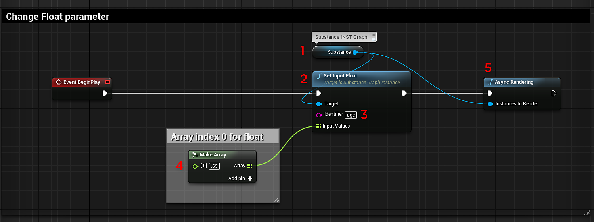

# Blueprint(UE5)：Substance材料参数

## 更改浮点参数：

您将使用[设置输入浮点节点](https://helpx.adobe.com/substance-3d/unlisted/documentation/integrations/blueprint-node-reference-151584784.html)来更改float、color(float4)和Boolean substance参数。

1. 创建类型为“Substance 图形实例”的变量作为引用。\
   \**为此，请在“我的蓝图”选项卡中添加一个变量并为其命名。 在下拉列表中，搜索“Substance 图形实例”>“对象引用”。 将变量拖到图形中，然后选择“获取（变量名称）”。 在“详细信息”选项卡的“默认值”部分中设置Substance 图形实例。*
1. 创建一个Set Input Float Node ，并将target设置为Substance 图形实例变量。 可能需要取消选中搜索窗口中的“上下文相关”框才能查看所有结果。
1. 在“设置输入浮点”节点上，将Identifier设置为要更改的Substance参数的名称。\
   *\*可以通过打开SubstanceINST并将鼠标悬停在参数名称上来查找标识符名称。 标识符名称将显示在工具提示弹出窗口中。*
1. 在输入浮点节点上，拖出一个连接并创建Make Array节点。 Make Array节点的索引为0。 索引0对应于浮点值。
1. 创建“异步”或“同步”渲染节点，并将执行行从“设置输入浮点”连接到“渲染节点”。 将要渲染的实例设置为Substance 图形实例变量。\
   *\*&#x200B;异步未阻止，同步正在阻止。*

{width="800px"}

## 布尔型参数

使用Set Input Bool更改布尔参数。

{width="800px"}

## 颜色参数

颜色参数可使用“设置输入颜色”进行更改。

{width="800px"}

## 更改Integer参数：

整数参数的工作方式与“设置输入浮点”相同。 您将使用Set Input Integer节点。

## 标识符

您可以在substance INST中找到参数的标识符。 将鼠标移到参数上，工具提示将显示标识符名称。 这是在Substance Designer输出的标识符字段中设置的名称。

