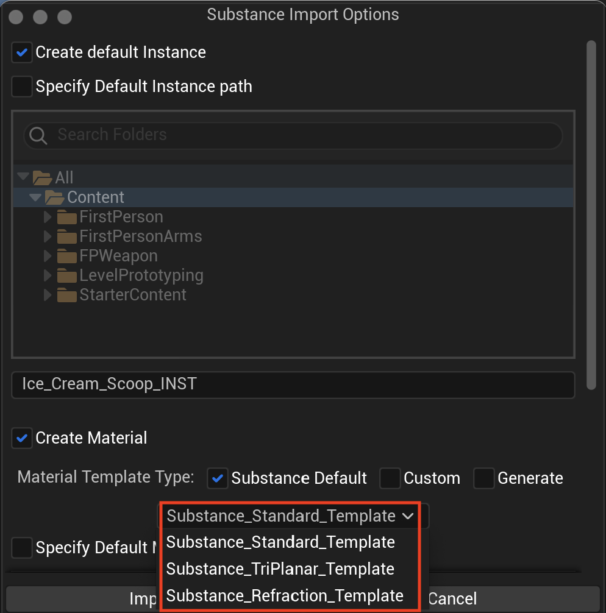
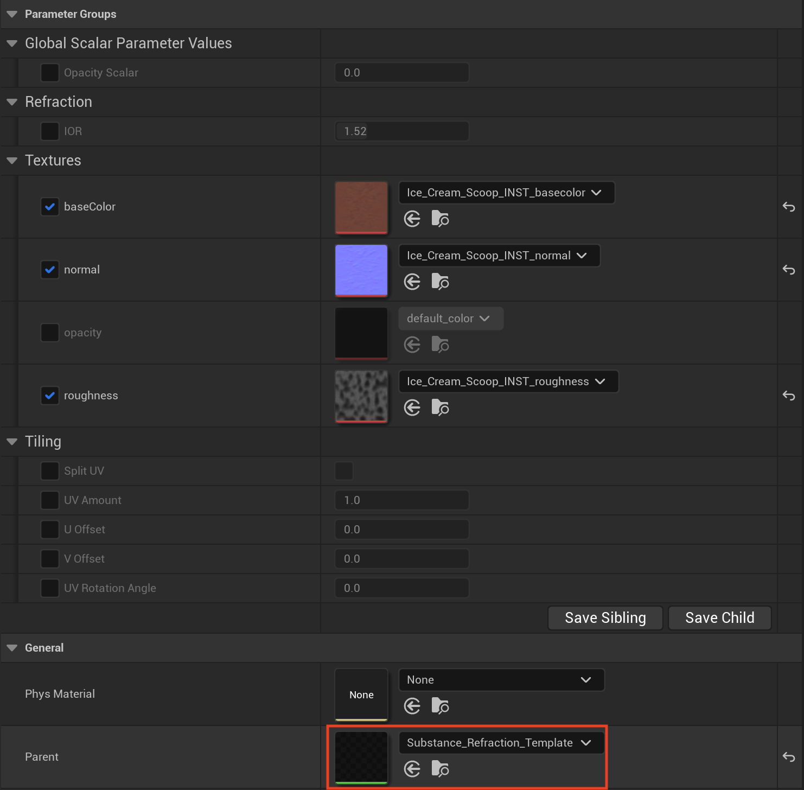
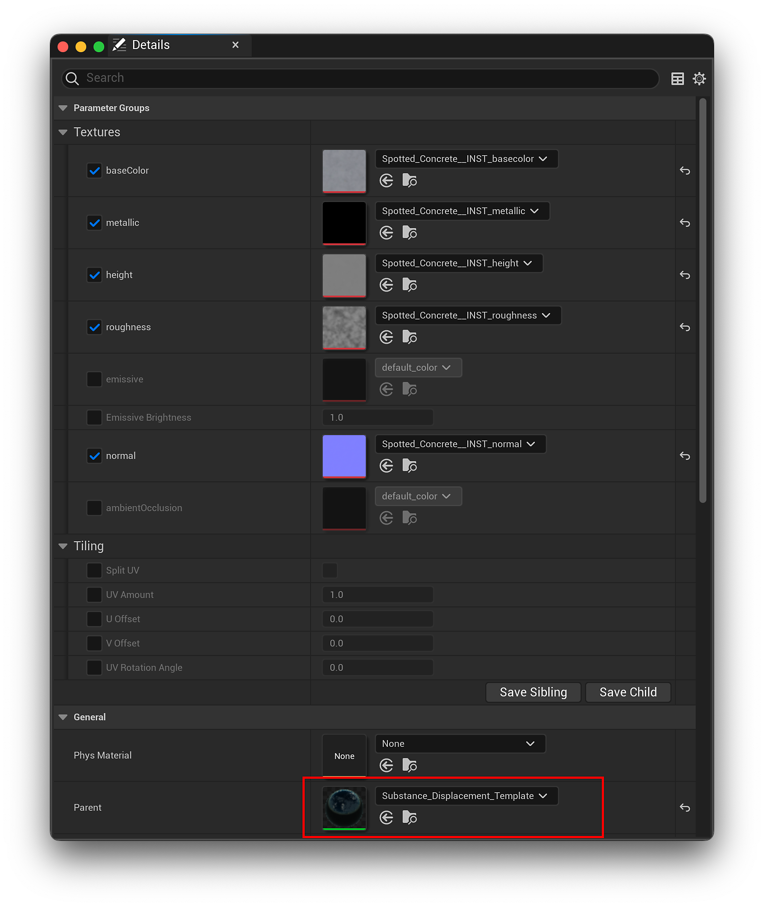

# 开箱即用的材质模板

将SBSAR素材导入内容浏览器时，您可以在下拉菜单中选择现成可用的不同素材模板。

## Substance标准模板

这是常规UV体验的基本材料模板。 它提供了一些控制UV大小的基本控件，因此您可以缩放UV以拉伸纹理。 您可以通过启用拆分UV选项拆分UV缩放，您还有U量、V量、UV 偏移和UV旋转角度。 这样，您可以进行一些UV拼贴和UV旋转。

## Substance三平面模板

三平面模板对网格的X、Y和Z角度或表面进行三平面映射，以便它将纹理的三个不同投影混合在一起，从而无缝地混合角度。 三平面模板允许在对象弯曲时跨不同表面将材料混合在一起

三平面模板具有物理尺寸支持，因此启用物理尺寸后，三平面模板将根据材质的物理尺寸缩放图像，因此，无论您缩放对象的程度，纹理将始终保持不变并具有统一的外观。 在此处了解更多物理尺寸： [物理尺寸- UE5](../../../../../game-engines/unreal-engine/unreal-engine-5/physical-size-ue5/physical-size-ue5.md)

## Substance折射模板

折射模板主要用于透明物体，例如玻璃。 它允许您修改玻璃材料或透明材料的IOR值或标准纹理。

## Substance汽车绘画模板

“汽车绘画”模板添加清晰的涂层支持，并支持可调整的UV拼贴和值、清晰的涂层粗糙度值和菲涅尔功率值。

## 设置位移模板

>[!IMPORTANT]
>
> 实验性模板
> 
> 警告：以下模板是实验性的，可能会在不同版本之间发生重大更改。 这些模板利用了Epic的Nanite特征，该特征本身是截至本文撰写时的实验性的。 它们可能不是100%稳定，在项目中使用它们时应谨慎。

使用以下步骤可完全启用项目中的Nanite位移支持，并将位移素材与网格结合使用。

1. 导航到项目文件夹>配置> DefaultEngine.ini并打开它
1. 将以下内容附加到[/Script/Engine.RendererSettings]部分：
   * r.Nanite.AllowTessellation=1
   * r.Nanite.Tessellation=1
1. 选择要应用位移模板的静态网格，然后打开其设置。
1. 切换启用Nanite支持选项。
1. 将所需的.sbsar导入内容浏览器，然后选择Substance\_Displaceent\_Template或Susbtance\_Triplanar\_Displacement\_Template
1. 要更改位移量，请定位至物料模板并选择输出节点。 然后，调整“位移”部分下的“模”。

## 位移模板

与Substance标准模板类似，此模板允许在添加纳米级位移支持的情况下调整U和V值。

## Substance三平面位移模板

与“位移模板”类似，此模板应用三面投影，并增加了物理尺寸支持和Nanite位移支持。

