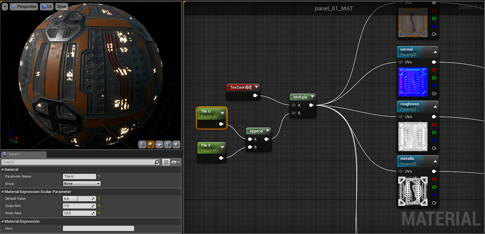

# Substance- UE5

要平铺Substance纹理，您需要添加纹理坐标节点，并将其乘以标量参数。

<https://docs.unrealengine.com/latest/INT/Engine/Rendering/Materials/ExpressionReference/Coordinates/#texturecoordinate>

要为U和V拼贴创建参数，您可以使用“追加矢量”并将此矢量乘以TexCoord。 这允许您单独设置U和V磁贴数量。

{width="800px"}
