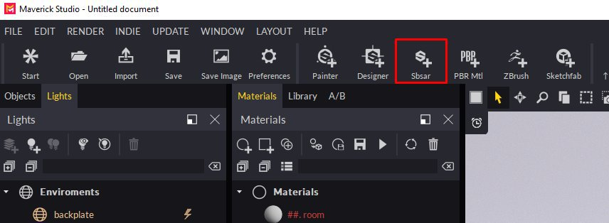

# SubstanceSBSAR集成

**&#x200B;**&#x200B;**您可以** **轻松携带** **SBSAR文件** **已创建** **在Substance Designer或Substance中** **Alchemist** **到** **特立克&#x200B;**&#x200B;**正在关注**&#x200B;**或** **/** **这些** **2** **方法**&#x200B;**：**

**方法** **1：**

1. 使用SBSAR图标并选择您的SBSAR文件。

   
1. 在“导入”对话框中，可以设置某些材料参数：

   
1. 继续操作，您将在“材质”面板中看到您的材质，准备就绪用于您的场景：

   

   **方法** **2**&#x200B;**：**
1. 只需将SBSAR文件从Windows资源管理器中拖放到场景中的任何对象上。 也可以将SBSAR文件拖放到“材质”面板上。
1. 在“导入”对话框中，可以设置某些材料参数：

   
1. 该材质将应用于您拖放到的对象。

   **提示与技巧：**
1. 您可以通过在“材质”面板中选择Substance节点或单击材质的一个通道塞来编辑SBSAR参数。
1. 我们建议您以512或1024的分辨率编辑素材，以便更流畅地进行编辑。 对于最终渲染，您可以将分辨率提高到2048或4096。
1. 如果要在场景中的另一个对象上使用相同SBSAR但使用不同参数，请复制该SBSAR并将其应用于新对象。 Maverick将自动创建一个可以独立编辑的新材质。
1. 如果场景中有多个SBSAR，则可以在其中任何一个中使用“设置为全局分辨率”按钮一次控制所有这些SBSAR的分辨率。

   
1. Maverick包含10种材质和SBSAR，您可以在着色库中的Materials/Substance和Maps/Sbsar文件夹下找到它们：

   
1. 如果您希望自己的SBSAR对Maverick可用，请创建子文件夹以将其放入

   “C:\Users\User\Documents\RandomControl\library\Shading\My地图”。

   然后，只需将它们放在对象上，以便Maverick可以创建相应的包装材料。

   可在Maverick中看到有关SBSAR的介绍视频： <https://youtu.be/HosZOoMRfcM>

   您可以在Maverick中看到一个使用SBSAR的实用示例： <https://youtu.be/ebVI5jJD71A>

   **支持** **链接：**

   邮件到[gorilla@maverickrender.com](https://helpx.adobe.com/mailto:gorilla@maverickrender.com)

   在Maverick网站[www.maverickrender.com](http://www.maverickrender.com/)中聊天
