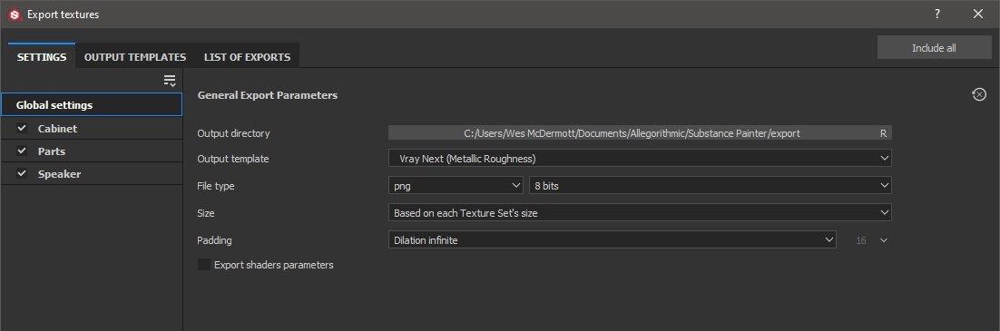

# 虚拟下一个 — Substance Painter

Substance Painter2020.1 (6.1.0)随附[VrayMtl](https://docs.chaosgroup.com/display/VRAY4MAYA/VRayMtl)着色器，适用于金属和Specular工作流程。 您可以[使用&#x200B;**VrayMtl模板**&#x200B;设置您的Substance Painter项目](https://docs.substance3d.com/display/SPDOC/Project+Creation)，该模板将配置您的视口着色器。

在“着色器设置”下，可以配置Vray着色器以使用VrayMtl。

>[!NOTE]
>
> 您的项目是否设置为使用[UV磁贴UDIM旧版](https://helpx.adobe.com/cn/substance-3d/unlisted/documentation/spdoc/uv-tile-udim-legacy-144310352.html)。 使用Vray Next UDIM输出模板。

{width="800px"}

要导出纹理以便在“Vray下一步”中渲染，请选择“Vray Mtl”输出模板。

{width="800px"}

## 变材质（变材质 — 下一个 — 金属/粗糙度）

| Substance Painter导出 | VRayMtl |
| --- | --- |
| 底色 | (**Maya**)漫射颜色（数量= 1.0） （**3ds最大值**）漫射 |
| 粗糙度 | (**Maya**)反射/粗糙度(BRDF = GGX) +（启用使用粗糙度）（**3ds最大**）粗糙度→ BRDF/使用GGX并启用使用粗糙度 |
| 金属 | (**Maya**)反射/金属性（**3ds最大值**）金属性 |
| 法线 | (**Maya**)凹凸和法线映射/映射（映射类型=正切空间中的法线）(**3ds** **Max**)位图→法线 |
| 高度 | (**Maya**)位移着色器/位移(**3ds** **Max**)对象修饰符→VrayDisplacementMod → Tex映射 |
| 放射 | 自照明 |
| 透射型 | (**Maya**)次表面散射/半透明颜色(**3ds Max**)半透明→背面颜色 |
| 各向异性角度 | (**Maya**)各向异性/各向异性旋转（**3ds** **最大**） BRDF/旋转 |
| 各向异性级别 | (**Maya**)各向异性/各向异性（**3ds最大**） BRDF/角度 |

## 可变素材(可变下一个 — Specular/光泽度

| Substance Painter导出 | VRayMtl |
| --- | --- |
| Diffuse | (**Maya**)漫射颜色（数量= 1.0） （**3ds最大值**）漫射 |
| 镜面 | (**Maya**)反射/反射颜色（数量= 1.0） （**3ds最大值**）反射 |
| Glossiness | (**Maya**)反射/粗糙度(BRDF = GGX) +（启用使用粗糙度）(**3ds Max**)光泽度→ BRDF/使用GGX并启用使用光泽度 |
| 法线 | (**Maya**)凹凸和法线映射/映射（映射类型=正切空间中的法线）(**3ds** **Max**)位图→法线 |
| 高度 | (**Maya**)位移着色器/位移(**3ds** **Max**)对象修饰符→VrayDisplacementMod → Tex映射 |
| 放射 | 自照明 |
| 透射型 | (**Maya**)次表面散射/半透明颜色(**3ds Max**)半透明→背面颜色 |
| 各向异性角度 | (**Maya**)各向异性/各向异性旋转（**3ds** **最大**） BRDF/旋转 |
| 各向异性级别 | (**Maya**)各向异性/各向异性（**3ds最大**） BRDF/角度 |

>[!NOTE]
>
> 需要正确解释表示数据的地图。 有关详细信息，请参阅[色彩管理](../../../renderers/color-management/color-management.md)页面。

此示例显示使用Vray金属/粗糙度着色器的Substance Painter视口和使用Maya的Vray渲染。

{width="800px"}
